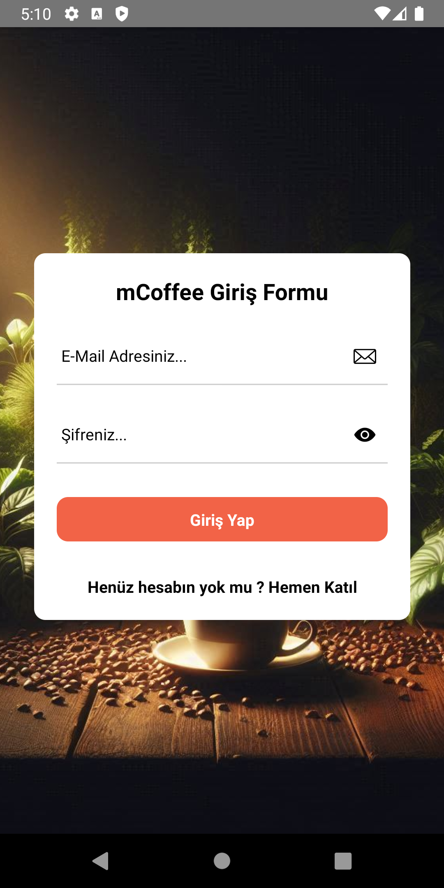
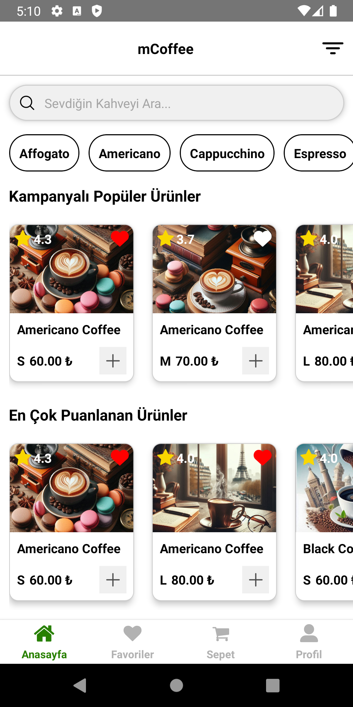
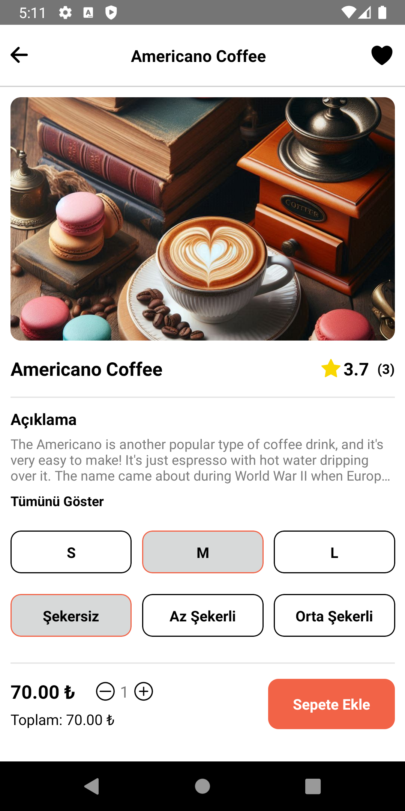
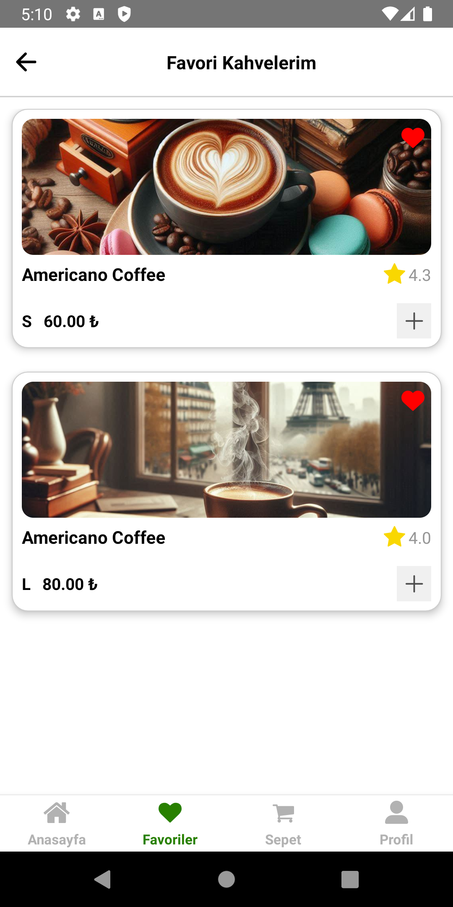
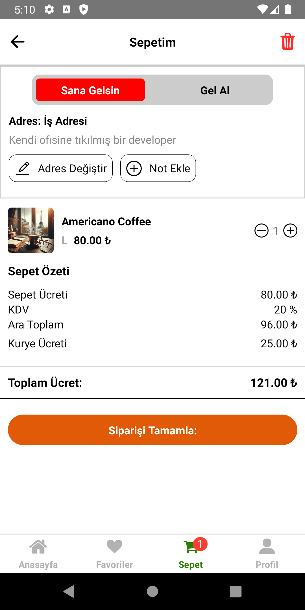
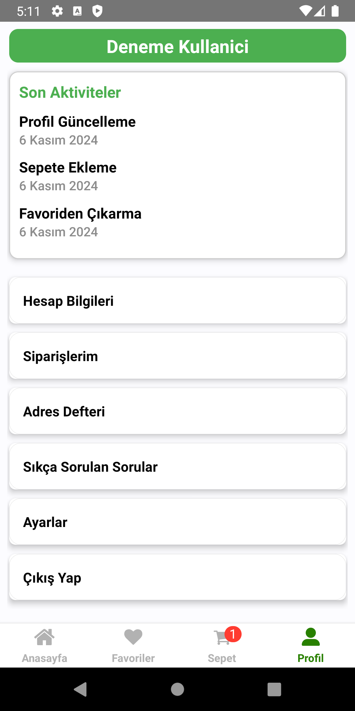

# React Native mCoffee Projesi (Laravel ile)

Kendimi geliştirme sürecinde kodladığım bu projenin tasarımı tamamen Rıdvan ÜÇDAĞ Bey'in Coffee Shop Mobile App projesine aittir. Tasarım izni ve bilgisi dahilinde bu projede kullanılmıştır.

Projenin ön kısmı React Native ile yazılmış, backend olarak da Laravel teknolojisi kullanılmıştır

Rıdvan ÜÇDAĞ Github Hesabı: https://github.com/ridvanucdag
Rıdvan ÜÇDAĞ Coffee Shop Mobile App Projesi: https://github.com/ridvanucdag/coffee-shop-mobile-app

Rıdvan ÜÇDAĞ Coffee Shop Mobile App Tasarımı:

Proje İçerisinden Görüntüler:

